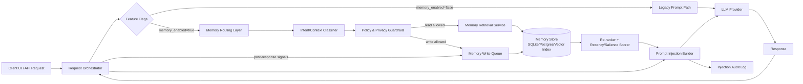

# Memory Integration Rollout

## Purpose
This rollout plan introduces persistent memory and controlled memory injection into prompts while preserving existing non-memory behavior by default.

## Scope
- Add persistence for user/session memory artifacts.
- Add routing logic that decides if and how memory should be retrieved.
- Add prompt injection pipeline for safely including memory context.
- Roll out behind feature flags with explicit gates and rollback.

---

## 1) Architecture Diagram (Persistence + Routing + Prompt Injection)

### Key responsibilities
- **Persistence layer**: stores memory records, metadata (user/session, source, timestamp, confidence), and embeddings/index pointers.
- **Routing layer**: determines retrieval/write eligibility based on intent, latency budget, and policy.
- **Prompt injection layer**: composes bounded memory snippets into system/developer context with token caps and source tags.

---

## 2) Migration Steps for Existing Installations

### Phase 0 — Pre-migration Readiness
1. Add schema migration scripts for memory tables/indexes.
2. Add config defaults with memory features disabled.
3. Add observability counters for retrieval attempts, injection success, and fallback to legacy path.

**Done criteria**
- Migration scripts are idempotent and succeed in staging.
- Deploying new build with all memory flags OFF produces no behavior change.
- Dashboards show zero memory-path traffic when flags are OFF.

### Phase 1 — Data Plane Introduction (No Runtime Use)
1. Deploy persistence components (DB tables, index, write queue).
2. Enable background write pipeline only in dry-run mode (validate payloads, do not serve retrieval).
3. Backfill optional historical signals if applicable (rate-limited).

**Done criteria**
- New storage objects are created successfully in all target environments.
- Dry-run write validation pass rate meets agreed threshold (e.g., >99.5%).
- No increase in request latency/error rate on legacy request path.

### Phase 2 — Read Path Shadowing
1. Turn on retrieval in shadow mode for internal tenants.
2. Compute retrieval results but do not inject into user-facing prompts.
3. Log relevance metrics and compare against expected intent coverage.

**Done criteria**
- Shadow retrieval success rate and relevance score hit target SLO.
- P95 latency overhead remains within budget (e.g., <50ms incremental).
- Privacy/policy audit confirms no disallowed scopes retrieved.

### Phase 3 — Controlled Prompt Injection
1. Enable injection for internal users with strict token cap and conservative top-K.
2. Add runtime circuit breaker for low-confidence retrievals.
3. Expand to pilot tenants after internal sign-off.

**Done criteria**
- Offline + online evals show response quality non-regression vs baseline.
- Hallucination/safety indicators do not degrade beyond agreed margin.
- Circuit breaker/fallback to legacy path is verified in production-like tests.

### Phase 4 — Gradual General Availability
1. Expand rollout in cohorts (e.g., 1% → 5% → 25% → 50% → 100%).
2. Monitor SLOs and quality metrics at each gate.
3. Keep rollback controls active throughout rollout.

**Done criteria**
- Each cohort holds steady for defined soak period without SLO breach.
- Incident rate remains within normal baseline band.
- 100% rollout completed with legacy path still callable via kill switch.

---

## 3) Feature-Flag Rollout Sequence

Use independent flags to avoid coupling and enable partial rollback:

1. `memory_schema_enabled`
   - Controls whether runtime expects new schema/index resources.
2. `memory_write_enabled`
   - Enables write queue processing (can run dry-run mode first).
3. `memory_read_shadow_enabled`
   - Enables shadow retrieval only (no prompt injection).
4. `memory_injection_enabled`
   - Enables actual prompt enrichment from retrieved memories.
5. `memory_enforcement_strict`
   - Enforces stricter policy thresholds (confidence/privacy).
6. `memory_global_kill_switch`
   - Immediate force-off for all memory read/write/injection at runtime.

### Rollout order
- Start: only `memory_schema_enabled=true`
- Then: `memory_write_enabled=true` (dry-run, then active)
- Then: `memory_read_shadow_enabled=true`
- Then: `memory_injection_enabled=true` (internal → pilot → cohorts)
- Optional hardening: `memory_enforcement_strict=true`
- Always available: `memory_global_kill_switch`

**Done criteria (flags)**
- Every flag is independently testable and observable.
- Toggling each flag does not require redeploy.
- Kill switch disables memory behavior within one config refresh interval.

---

## 4) Rollback Procedure

### Trigger conditions
- Memory-related latency or error budget breach.
- Quality/safety regression detected in canary or larger cohort.
- Policy/privacy incident or unexpected scope leakage.

### Rollback steps (fast path)
1. Set `memory_global_kill_switch=true`.
2. Confirm traffic returns to legacy path (routing metrics).
3. Disable `memory_injection_enabled` and `memory_read_shadow_enabled`.
4. If needed, disable `memory_write_enabled` to stop new writes.
5. Keep schema intact unless migration rollback is explicitly required.
6. Open incident review, preserve logs, and capture offending request IDs.

### Rollback steps (data path cleanup, if required)
1. Pause background jobs/consumers.
2. Quarantine suspect memory entries by tenant/time window.
3. Re-index or rebuild corrupted index segments.
4. Re-enable shadow mode only after validation.

**Done criteria (rollback)**
- Legacy behavior restored and stable within defined recovery objective.
- No memory injection events observed post-kill-switch.
- Root-cause hypothesis documented with corrective action owner/date.

---

## 5) Verification Checklist for QA/UAT

## Functional checks
- [ ] With all memory flags OFF, behavior matches baseline snapshots.
- [ ] Writes occur only when `memory_write_enabled=true`.
- [ ] Shadow reads never alter prompt content.
- [ ] Injection path adds only bounded, source-tagged memory snippets.
- [ ] Low-confidence retrieval triggers fallback path.

## Safety/privacy checks
- [ ] Cross-user/session isolation validated.
- [ ] Policy filters remove restricted content categories.
- [ ] Redaction/masking is applied where required.
- [ ] Audit logs capture retrieval and injection decision metadata.

## Performance/reliability checks
- [ ] P50/P95 latency overhead stays within target.
- [ ] Error rate remains within normal control limits.
- [ ] Circuit breaker behavior validated under retrieval failures.
- [ ] Kill switch effectiveness validated in runtime environment.

## UAT acceptance checks
- [ ] Pilot users confirm improved continuity in multi-turn interactions.
- [ ] No critical regressions in response relevance/grounding.
- [ ] Support runbook updated with rollout + rollback controls.
- [ ] Product and engineering sign-off recorded per rollout gate.

**Done criteria (QA/UAT gate)**
- All checklist items passed or formally waived with approval.
- Go/No-Go decision recorded for each rollout cohort.
- Monitoring and on-call ownership confirmed before next phase.

---

## Incremental Shipping Plan (Non-Blocking)

- **Increment A:** schema + observability only (zero runtime behavior change).
- **Increment B:** write pipeline dry-run + shadow retrieval (no user-visible change).
- **Increment C:** internal prompt injection with strict caps.
- **Increment D:** pilot + staged cohort expansion.
- **Increment E:** GA with kill switch retained.

Each increment is independently shippable and has explicit done criteria above, so teams can release progressively without blocking existing behavior.
